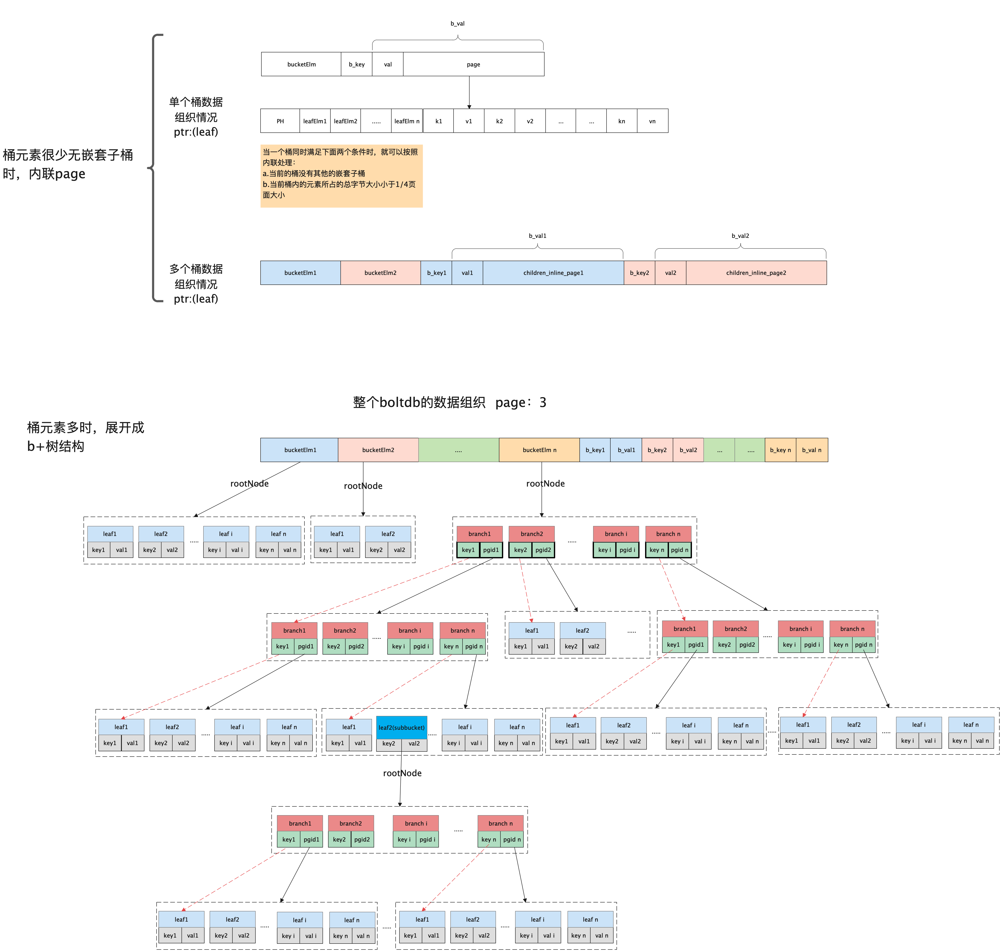

- [x] Open 打开db
- [x] DB.Begin() 开启事务
- [x] Tx.CreateBucketIfNotExists 如果存储桶不存在就创建，否则直接返回这个桶
- [x] Tx.Bucket 查找桶，不存在返回nil
- [x] Tx.Commit 提交事务 
- [x] Bucket.Put()
- [x] Bucket.Get()
- [x] Bucket.Delete() 删除指定的key
- [x] Bucket.DeleteBucket() 删除指定的桶，并释放桶所使用的页
- [x] Cursor.First() 把游标移到桶内第一个元素，并返回 key value
- [x] Cursor.Next()  把游标移到下一个元素，并返回 key value 有 bug 空节点异常
- [x] Cursor.Last()  把游标移到最后一个元素，并返回 key value
- [x] Cursor.Prev()  把游标移到上一个元素，并返回 key value
- [x] Cursor.Seek()  把游标移到给定的key，并返回 key value, 如果没找到，返回下一个元素的
- [x] Cursor.Delete() 删除游标所在的元素

## bbolt 为什么有两个 meta 页？
bbolt 每次事务结束会更新 meta，两个 meta 哪个 tx id 最大就用哪个.  
又因为 bbolt 写入文件会申请一个新页面，旧页面不会动，会加到 freelist 里，如果提交事务的时候发生了服务器关机断电异常情况
下次重新打开的时候还是使用旧的meta，指向旧的页数据，保证 db 文件不会损坏

## 事务提交时会分为两步，第一是把新的页数据写到磁盘，第二是把 meta 写入磁盘，那么写meta断电了，数据会丢吗？
答：会丢失  
假如我插入了几十万条数据，分配了几千页，第一步把几千页写入到磁盘，第二步写meta到磁盘时断电了  
此时 db 文件很大，但是可用页还是之前的页，这次新分配的几千页 db 是找不到的，因为 db 是从 meta 找的，这几千页还没有和
meta 关联起来，浪费了这么大的文件，但是如果后续开辟新页可以复用这些未使用的页，因为分配新页时会判断如果文件够大就不会新增文件大小  
使用 Compact 可以重新压缩，回收源数据库不再使用的空间

## 这个 issue 描述了 bbolt 内部结构
https://github.com/boltdb/bolt/issues/114

资料：https://jaydenwen123.github.io/boltdb/chapter3/boltdb%E7%9A%84Bucket%E7%BB%93%E6%9E%84.html

图片很关键
